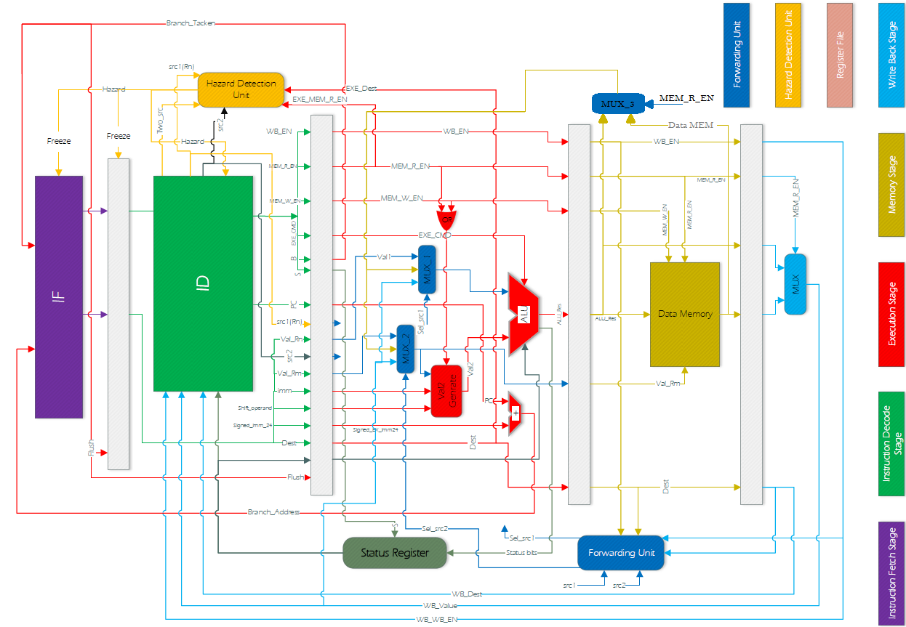

# ARM968E-S Processor Implementation on FPGA

## Overview

This project showcases a custom-designed ARM968E-S processor implemented on an Altera Cyclone II EP2C35F672C6 FPGA using Verilog. The processor architecture is organized in a five-stage pipeline, including Instruction Fetch, Instruction Decode, Execution, Memory Access, and Write-Back. Each pipeline stage is detailed below, with accompanying Verilog files, simulation outputs, and testing procedures.

## Repository Structure

### 1. **Source Code**
   - **`IF/`**: Contains Verilog modules for the Instruction Fetch stage, including the Program Counter, MUX for branch selection, and associated modules.
   - **`ID/`**: Instruction Decode stage Verilog files. Components include the Register File, Control Unit, and Condition Check modules to decode instructions and generate control signals.
   - **`EXE/`**: Execution stage modules, featuring the ALU, Val-2-Generator, and Status Register. This stage performs arithmetic and logical operations as specified in the instruction.
   - **`MEM/`**: Memory Access stage Verilog code. Modules handle load/store operations to and from Data Memory, managing memory interactions efficiently. Cache is also can be found in this folder
   - **`WB/`**: Write-Back stage, which writes the computed results back to the Register File. This stage completes each instruction’s execution cycle.

### 2. **Testbenches**
   - **`testbench/`**: Testbenches for each stage are available for simulation using ModelSim. Each testbench is located in the related folder and set up to verify the Verilog code for its corresponding pipeline stage, ensuring correct data flow and functionality.
### 3. **Documentation**
  - **`ARM968E-S Processor`**: PDF file with a complete document, detailing the pipeline stages and data flow.
  - **`Figures/`**: High-quality illustrations embedded in the LaTeX file, showing the data paths, cache structures, and pipeline stages.
     
### 4. **Cache Implementation**
   - **`MEM/`**: Verilog files for a two-way associative cache, reducing memory access latency with an LRU replacement policy. Cache controller logic is implemented here to handle memory requests from the pipeline stages.
